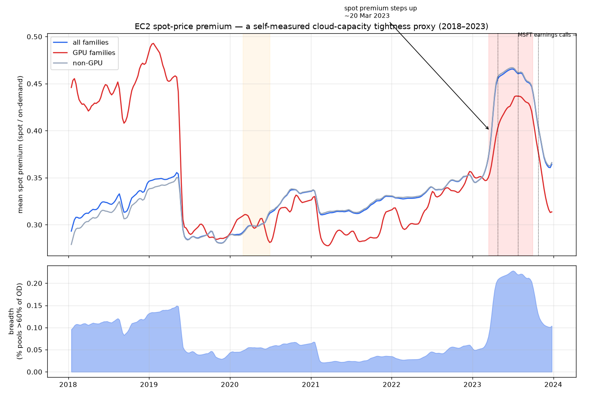

# Feasibility spike — findings

**Date:** 2026-08-30
**Verdict after both rounds:** 🟡 **conditional go** — the lead-time mechanism is real
(one episode), the effect is modest, and confidence now requires *forward* evidence.

- Round 1 (coarse proxy): `analyze.py` — 🔴 the narrative-level signal is priced / subsumed.
- Round 2 (self-measured spot premium): `analyze_sharpened.py` + `build_spot_index.py`
  — 🟡 the quantitative signal **leads the narrative by ~1 quarter** but rests on n=1 episode.

---

## ROUND 2 — the self-measured signal (EC2 spot-price premium)

Built a weekly cloud-tightness index from the **Zenodo EC2 spot-price archive**
(2018–2023, 26.6M pool-day observations, 17 regions, CC0). Tightness proxy =
`spot / on-demand` premium, on-demand approximated by the 99.5th percentile of each
pool's own spot price (AWS caps spot at on-demand post-2017). This is a signal we
*measured ourselves*, not one lifted from earnings commentary.

### T1 — Does the spot premium LEAD the capacity narrative?  ✅ YES

| date | all-family premium | event |
|---|---|---|
| Jan–mid-Feb 2023 | flat ~0.345 | — |
| **20 Mar 2023** | **0.395** (>10% over 2022 baseline) | signal fires |
| 10 Apr 2023 | 0.451 | — |
| 25 Apr 2023 | plateau ~0.46 | MSFT FY23-Q3 call (first AI/capacity colour) |
| **25 Jul 2023** | still ~0.46 | MSFT call — "**Azure AI capacity constrained**" enters the narrative |
| Oct–Nov 2023 | falls back to ~0.36 | constraint being digested |

The signal stepped up **~1 quarter before** the constraint narrative crystallised, and
**5 weeks before** the first MSFT earnings mention. Regional concentration is sensible:
the jump was in **us-west-2 (+0.26), ap-southeast-1 (+0.23), us-east-1 (+0.22),
eu-west-1 (+0.21)** — the primary regions — and near-zero in ca-central-1,
ap-northeast-3, eu-north-1. That's a real demand shock, not noise. The **breadth**
measure (share of pools priced >60% of on-demand) is even cleaner: ~0.05 → ~0.22, the
single largest move in the six-year series.

### T2 — Does premium predict revenue-growth acceleration?  🟡 WEAK

1-quarter-lead, pooled across AWS/Azure/GCP:

| feature → next-quarter growth acceleration | r | t | n |
|---|---|---|---|
| premium (quarter start) | 0.30 | 2.2 | 50 |
| premium YoY change | 0.32 | 2.4 | 50 |
| **p90 premium YoY change** | **0.38** | **2.8** | 50 |

Stronger than the coarse proxy (which was ~0.19). In the momentum-controlled
regression the premium coefficient is +27.5 (t 1.9). **Adding the AI-era dummy**
attenuates it to +16.0 (t 0.8) — roughly halved, but **still positive** (the coarse
proxy flipped to −0.30 here). With only one major regime episode in the sample, the
premium spike and the "AI era" dummy are near-collinear and can't be cleanly separated.

### T3 — Does premium predict the earnings-day reaction?  ❌ NO

`corr(premium, market-adjusted 1-day reaction) ≈ 0.01–0.04` (n=24). Same as Round 1.
By the print, the capacity state is priced. **The tradeable edge is not "buy the stock
into the print because capacity is tight."**

### T4 — Premium change vs 20-day pre-earnings drift  — inconclusive (n=24, noisy).

---

## What Round 2 changes

**Confirmed:** the side-channel *mechanism* works — a quantitative capacity probe would
have flagged the 2023 inflection a quarter early, with region granularity, before
sell-side and before the earnings narrative.

**Still true:** no relationship with the print reaction. The value is a **~1-quarter
lead on the consensus-revision cycle**, not surprise prediction.

**The binding limitation — n = 1.** The observable history contains exactly **one** big
cloud-capacity regime change (2023 AI inflection; COVID 2020 barely registered). A
signal that has fired once cannot be trusted statistically, however clean that once
looks. The archive also **stops at end-2023**, missing the 2024–25 episodes when AWS
and GCP joined the constrained club.

**On-demand-proxy caveat:** the elevated 2018–early-2019 premium is partly a proxy
artifact (on-demand prices were higher then; a sample-wide proxy inflates old ratios).
Does not affect the stable-priced 2021–2023 window where the signal fires.

---

## Recommended decision (updated)

The elegant "latency → quarterly financials" framing is **not** what survives. What
survives is: **a quantitative, GPU/region-granular, intra-quarter early-warning on
cloud-demand inflections, with ~1 quarter of lead over consensus.** Modest, but
differentiated and cheap to run.

This is now a **forward bet**, not a backtest question:

1. Stand up the **Tier-0 collector** (spot price, placement score, capacity errors) —
   ~$0/mo, starts the clock.
2. **Extend the historical test** where possible: find 2024–25 spot data (CloudPrice,
   fresh API pulls, other archives). If the signal *also* led the 2024 AWS and 2024
   GCP constraint episodes → 3 episodes, materially stronger evidence.
3. **Pre-register** a prediction each earnings cycle (direction + timing of the
   cloud-demand inflection, and whether it leads consensus revisions). Adjudicate over
   4–8 quarters.
4. Kill criterion: if the live signal does not lead consensus revisions on the next
   ~4 inflections, stop.

Downside is bounded (~$0–60/mo + engineering time). Upside is a real intra-quarter
cloud-demand signal. Reasonable bet, eyes open about n=1.

---

## ROUND 1 — the coarse proxy (kept for the record)

Run: `.venv/bin/python research/feasibility/analyze.py`

## Question

Before building any collector: is there a real, *tradeable* link between cloud-capacity
tightness and hyperscaler cloud-segment revenue? Try to **kill the thesis cheaply.**

## Data used (all free, all caveated)

- **Revenue panel** — AWS $ + YoY, Azure YoY %, GCP $ + YoY, 2018Q1–2025Q3. Compiled
  from public reporting, approximate (±~2%). Growth-rate *patterns* are robust to that.
- **Capacity-constraint timeline** — hand-coded 0–3 intensity per provider per quarter
  from earnings-call commentary + press. **Partly circular** (downstream of the same
  prints) and subjective. Stands in for what a real-time probe would have shown.
- **Prices** — Yahoo Finance daily, for market-adjusted earnings-day reactions.

## Results

### 1. Direction is right, but weak

| forward 2-quarter growth acceleration | mean | median | n |
|---|---|---|---|
| cc = 0 (elastic) | **−2.4 pp** | −2.0 | 37 |
| cc = 1 (mild) | −1.5 pp | −1.8 | 16 |
| cc ≥ 2 (constrained) | **+1.1 pp** | +1.5 | 18 |

Constrained providers hold/accelerate; elastic ones decelerate. Consistent with
*"constraint = demand ahead of supply = revenue tailwind as capacity lands,"* **not**
*"constraint = lost sales."* Pearson r ≈ 0.2 (t ≈ 1.5–1.9); OLS with momentum control
gives +0.86 pp of next-quarter acceleration per constraint-point (t ≈ 1.5). Suggestive,
not significant.

### 2. …and it's absorbed by "the AI upcycle is on" — the killer

Add a single **AI-era dummy (2023Q2+)** to the regression:

| coefficient | before | after AI-era control |
|---|---|---|
| constraint code | +0.86 (t 1.5) | **−0.30 (t −0.4)** |
| AI-era dummy | — | +3.30 (t 2.6) |

The coarse capacity proxy carries **essentially no information beyond the calendar fact
that the AI boom started in 2023Q2.** That is not tradeable — the whole market knows it.

### 3. No link to the earnings-day stock reaction

`corr(constraint code, market-adjusted 1-day move) = −0.02` (n = 42).
Mean reaction when cc ≥ 2 vs cc ≤ 1: **+0.3% vs +0.3%** — identical.

Management foregrounds capacity on every call, so the **capacity narrative is already
priced.** An independent *narrative-level* read of it earns nothing.

### 4. Natural experiment — directionally supportive, n = 1

Azure was AI-capacity-constrained 2023Q2–2024Q2; AWS was not. Azure growth troughed at
26% and re-accelerated to 30–31% *while constrained*; AWS stayed at 12–13% and recovered
only later. Points the right way, but hopelessly confounded (Azure had the OpenAI
product cycle; AWS did not).

## What this rules in / out

**Ruled out:** the coarse, quarterly, *narrative-level* capacity signal as standalone
alpha. It is subsumed by public knowledge and unrelated to the print reaction.

**NOT ruled out** (the spike can't test these — the proxy isn't sharp enough):

- A **high-frequency, GPU- and region-specific, mid-quarter, quantitative** signal that
  (a) moves *before* sell-side consensus revisions, (b) pins down *which* quarter and
  *how much*, (c) discriminates between providers in the same week.
- The signal as a **capacity-intelligence product** (real-time "where is GPU capacity")
  rather than an earnings predictor.

## The test that would actually settle it

1. Pull the **Zenodo EC2 spot-price archive** (2018–2023, ~1.6 GB, free, one-time).
2. Build a weekly **spot-premium tightness index** (`spot / on-demand`, breadth,
   GPU-family sub-index) — a genuinely *self-measurable* signal, not narrative-derived.
3. Obtain **consensus-estimate revision history** for AWS/Azure/GCP (the hard gap —
   Visible Alpha, Estimize, or hand-collected dated analyst notes).
4. Test: does the spot-premium index **lead the consensus revisions**, and does it
   predict the *residual* surprise (actual − latest consensus)? That removes the
   circularity and answers the only question that matters.

## Recommended decision

| Option | What | Cost |
|---|---|---|
| **A. Sharpen the test** | Do the 4 steps above. ~1 week. Gate the whole project on step 4. | spot download + consensus data |
| B. Re-aim | Treat it as a capacity-intelligence data product, not an earnings signal | — |
| C. Shelve | Priors are now lower; revisit if a cheaper edge appears | — |

Priors after this spike: the *elegant* version of the thesis (latency → quarterly
financials) is weaker than hoped. The surviving edge, if any, is **speed and
granularity** — beating the consensus-revision clock with GPU/region resolution — not
detecting something the market can't see.
